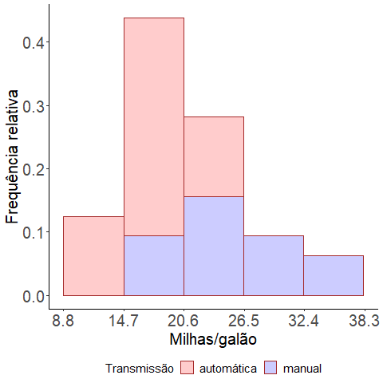

XII Programa de Verão DES-ICET/UFLA - 2021 
---
Um curso introdutório dos pacotes ggplot2 e tmap disponíveis no R
---
```{r setup, include=FALSE}
knitr::opts_chunk$set(echo = TRUE)
```

## **Primeira parte**


## Introdução

O pacote `ggplot2` está disponível para instalação no repositório CRAN do R para as versões $3.1.1$ ou superiores, sendo fruto da tese de doutorado do pesquisador Hadley Wickham. Este pacote é voltado para a criação de gráficos estatísticos. Mas como construir um gráfico estatístico? Segundo Hadley, um gráfico estatístico é construído baseado na gramática em camadas de gráficos e tem origem a partir de `atributos estéticos` (posição, cor, forma, tamanho) de `objetos geométricos` (pontos, linhas, barras, caixas, etc...).

Hadley  sugere em seu livro *ggplot2: Elegant Graphics for Data Analysis* que dados, sistemas de coordenadas, rótulos e anotações possam ser divididos em `layers`(camadas). Essas camadas são construídas uma a uma na elaboração de gráficos estatísticos. Essa é a essência deste pacote.

O pacote `ggplot2` apresenta algumas vantagens em relação a outros pacotes mais conhecidos disponíveis no `R`. Primeiro, os gráficos produzidos pelo `ggplot2` são mais `bonitos`. Segundo, o mesmo permite maior `controle` do usuário. Terceiro, as funções utilizadas neste pacote seguem um certo `padrão` e são `fáceis` de utilizar. Quarto, é possível construir `vários` gráficos com `poucas` linhas de comando. Mas o que é a gramática em camadas de gráficos?

## A gramática em camadas de gráficos

Basicamente podemos descrever individualmente qualquer gráfico como uma combinação de um `conjunto de dados`, um `geom`, um `conjunto de mapeamentos`, um `stat`, um `ajuste de posição`, um `sistema de coordenadas` e um esquema de `facetas`. Para melhor entendimento, pense que vamos construir um gráfico começando do zero. Então, o primeiro passo é obter um `conjunto de dados`. Depois precisamos transformá-lo na informação em que queremos exibir (`stat`). Em seguida, podemos escolher um objeto geométrico para representar cada observação nos dados transformados. O próximo passo é utilizar as propriedades estéticas dos `geoms` para representar variáveis nos dados. Nós maperíamos os valores de cada variável aos níveis de uma estética. O próximo passo é selecionar um `sistema de coordenadas` no qual os `geoms` seriam colocados. Nosso gráfico então estaria completo. Mas nós podemos ainda dividir esse gráfico em `facetas` (subgráficos). Também poderíamos adicionar outras camadas adicionais, sendo que cada uma delas usaria um `conjunto de dados`, um `geom`, um `conjunto de mapeamentos`, um `stat` e um `ajuste de posição`. 


## Como construir gráficos utilizando o pacote ggplot2?

Abaixo apresentamos os sete elementos que envolvem a construção de gráficos no ggplot2. Os elementos marcaddos com `*` são essenciais e obrigatórios. Os termos em negrito, como em **aes**, representam as funções a serem utilizadas no ggplot2 para a construção dos gráficos.

| Elementos | Exemplos | 
|----------------|-----------------------------------------------------------------------|
| **aes**tética$^*$ | cor, formato|
| **geom**etrias$^*$ | barra, ponto|
| e**stat**ísticas (modelos) | mediana, máximo|
| **facet**as | facetas|
| **coord**enadas | polar, cartesiana|
| **them**as | eixos, títulos|

Vamos agora realizar essa construção passo a passo no R. Os dados devem ser um `data.frame`. Essa condição é obrigatória para o uso do ggplot2. Primeiramente vamos instalar e carregar o pacote `ggplot2`. Depois, vamos colocar o conjunto de dados `mtcars`, disponível no R, em `data.frame`. Feito isso, nós estamos em condições de iniciar a construção de gráficos no `ggplot2`.

```{r mtcars, echo=TRUE}
library(ggplot2)
mtcars <- as.data.frame(mtcars)
```

A primeira camada (layer) necessária para a criação de gráficos no `ggplot2` é dada pelo comando `ggplot(dados)`. Neste comando, estamos criando a `área` onde o gráfico será construído e, ainda, informando ao `ggplot2` qual o conjunto de dados que contém essas variáveis. 
```{r, echo=TRUE}
ggplot(mtcars)
```

<!-- -->

Note que aparece uma área (em cinza) onde será construído o gráfico. Essa área ainda não contém nenhum formato `geométrico` como, por exemplo, pontos, barras, caixas, etc. Esse é o próximo passo. 

Precisamos informar ao `ggplot2` qual o formato geométrico `(geom\_tipo)` que queremos construir o nosso gráfico. Além disso, precisamos informar também ao ggplot2 qual a `estética` (aes(x,y,cores)) que queremos dar ao nosso gráfico: variável do eixo X, variável do eixo Y, cores, etc. Para isso, nós utilzamos o comando `geom\_tipo(aes(x,y,cores))`. Note também que a cada acréscimo de camada utilzamos o sinal `+`. 
```{r, echo=TRUE}
ggplot(mtcars) +
  geom_point(mapping = aes(x= disp, y=mpg))
```

<!-- -->

A variável `disp` signfica cilindradas e a variável `mpg` significa milhas por galão. Note que ainda não escolhemos a cor dos pontos do gráfico nem rotulamos seus eixos. Nosso gráfico ainda está incompleto.

Para escolhermos a cor da forma geométrica dos gráficos gerados pelo `ggplot2`, temos três comandos: `color`, `colour` e `fill`. O comando `color` é utilzado nos gráficos de dispersão (pontos) pois, por definição, pontos não possuem área. O comando `colour` é utilizado quando desejamos colorir a borda de um ente geométrico que represente uma `área`: caixas, barras, etc. O comando `fill` é utilizado para colorir o interior desses entes geométricos (preenchimento). Além disso, esses comandos podem ser utilizados dentro do comando aes ou fora dele, diferenciando apenas no argumento a ser utilizado. Os exemplos a seguir ilustram bem sua utilização.

```{r, echo=TRUE}
 ggplot(mtcars) +
  geom_point(mapping = aes(x= disp, y=mpg, color=as.factor(am))) +
  labs(x="Cilindradas", y="Milhas/galão")
```

<!-- -->

Note que utilzamos o comando `color` pois trata-se de um gráfico de dispersão. Além disso, a variável `am`, que significa tipo de tranmissão e é rotulada como: `0` representando transmissão automática e `1` representando transmissão manual, foi escolhida para ser utilizada no comando `color`. Então, os pontos do nosso gráfico foram coloridos de acordo com `os níveis` dessa terceira variável. Além disso, foi criado uma legenda automática. 

No próximo exemplo, construímos o mesmo gráfico, porém agora com o comando `color` fora do comando `aes`. Note que agora temos a liberdade de escolha da cor que quisermos para os pontos do gráfico. Porém, uma legenda automática não é criada. Mais adiante veremos como construir uma legenda.

```{r, echo=TRUE}
 ggplot(mtcars) +
  geom_point(mapping = aes(x= disp, y=mpg), color=c("red"))+
  labs(x="Cilindradas", y="Milhas/galão")
```

<!-- -->

Então podemos concluir que todos os comandos que estão dentro da função `aes` são relacionados a `variáveis`. Vamos agora apresentar um exemplo da construção de um `boxplot`, onde vamos utilizar os comandos `colour` e `fill`. A variável utilizada será a `mpg`, que é contínua.

```{r, echo=TRUE}
 ggplot(mtcars) +
  geom_boxplot(aes(x = as.factor(cyl), y = mpg, colour=as.factor(cyl))) +
  labs(x = "Número de cilindros", y = "Milhas/galão")
```

<!-- -->

Note que agora utilizamos o comando `colour` com a variável `cyl`. Como dissemos anteriormente, apenas a borda das caixas do boxplot foi colorida. A mesma foi colorida de acordo com os níveis da variável `cyl`.

No próximo passo vamos utilizar o comando `fill`. Vejamos a diferença.

```{r, echo=TRUE}
 ggplot(mtcars) +
  geom_boxplot(aes(x = as.factor(cyl), y = mpg, fill=as.factor(cyl))) +
  labs(x = "Número de cilindros", y = "Milhas/galão")
```

<!-- -->

Os comandos `colour` e `fill` podem ser utilizados conjuntamente. Vejamos.

```{r, echo=TRUE}
 ggplot(mtcars) +
  geom_boxplot(aes(x = as.factor(cyl), y = mpg, fill=as.factor(cyl), 
                   colour=as.factor(cyl))) +
  labs(x = "Número de cilindros", y = "Milhas/galão")
```

<!-- -->

Note que, neste último caso, o `boxplot` está fora dos padrões. Não conseguimos identificar quem é a `mediana`, nem os `quartis`. Isso ocorre que por não temos a liberdade de escolha de cores quando os comandos `color`, `colour` e `fill` são utilizados dentro da função `aes`. 

Neste momento, vamos utilizar estes comando fora da função `aes`. Vejamos a diferença

```{r, echo=TRUE}
 ggplot(mtcars) +
  geom_boxplot(aes(x = as.factor(cyl), y = mpg), fill=c("red", "green", "blue"), 
               colour="brown") +
  labs(x = "Número de cilindros", y = "Milhas/galão")
```

<!-- -->

Podemos ainda escolher a tonalidade das cores que escolhemos. Para tal, basta darmos o comando `alpha`. Os valores de alpha estão entre `0` e `1`. Valores mais próximos de `0` indicam tonalidade mais `fraca`. Vejamos.

```{r, echo=TRUE}
 ggplot(mtcars) +
  geom_boxplot(aes(x = as.factor(cyl), y = mpg), fill=c("red", "green", "blue"),
               colour="brown", alpha=0.2) +
  labs(x = "Número de cilindros", y = "Milhas/galão")
```

<!-- -->

Como dissemos anteriormente, o `ggplot2` permite ao usuário a liberdade de escolha para formatar seus gráficos e deixá-los apresentáveis. Observe que estes gráficos ainda não apresentam uma boa qualidade. Caso desejarmos retirar as `linhas de grade` que estão no plano de fundo da área do gráfico, acrescentarmos `legenda` manualmente, escolhermos a `fonte`, o `tamanho` de letra dos rótulos, destacarmos os `eixos`, entre outras coisas, é possível com o `ggplot2`. Os comandos a seguir fazem este trabalho. Construímos o mesmo gráfico um grande número de vezes, cada um com sua particularidade.

```{r, echo=TRUE}
 ggplot(mtcars) +
  geom_boxplot(aes(x = as.factor(cyl), y = mpg, fill=as.factor(am)), colour="brown", 
               alpha=0.2) +
  labs(x = "Número de cilindros", y = "Milhas/galão") +
  theme_bw() +
  theme(legend.position="top", 
        legend.box = "horizontal",legend.title=element_text(size=15), 
        legend.text=element_text(size=15), axis.text=element_text(size=20),
        axis.title=element_text(size=20), axis.line = element_line(colour = "black"),
        panel.grid.major = element_blank(),
        panel.grid.minor = element_blank(),
        panel.border = element_blank(),
        panel.background = element_blank()) +
  scale_fill_manual(values=c("red", "blue"), 
                       name="Transmissão",
                       breaks=c("0", "1"),
                       labels=c("automática", "manual"))
```

<!-- -->


```{r, echo=TRUE}
 ggplot(mtcars) +
  geom_boxplot(aes(x = as.factor(cyl), y = mpg, fill=as.factor(am)), colour="brown", 
               alpha=0.2) +
  labs(x = "Número de cilindros", y = "Milhas/galão") +
  theme_bw() +
  theme(legend.position="bottom", 
        legend.box = "horizontal",legend.title=element_text(size=15), 
        legend.text=element_text(size=15), axis.text=element_text(size=20),
        axis.title=element_text(size=20), axis.line = element_line(colour = "black"),
        panel.grid.major = element_blank(),
        panel.grid.minor = element_blank(),
        panel.border = element_blank(),
        panel.background = element_blank()) +
  scale_fill_manual(values=c("red", "blue"), 
                       name="Transmissão",
                       breaks=c("0", "1"),
                       labels=c("automática", "manual"))
```

<!-- -->


```{r, echo=TRUE}
 ggplot(mtcars) +
  geom_boxplot(aes(x = as.factor(cyl), y = mpg, fill=as.factor(am)), colour="brown", 
               alpha=0.2) +
  labs(x = "Número de cilindros", y = "Milhas/galão") +
  theme_bw() +
  theme(legend.position="left", 
        legend.box = "horizontal",legend.title=element_text(size=15), 
        legend.text=element_text(size=15), axis.text=element_text(size=20),
        axis.title=element_text(size=20), axis.line = element_line(colour = "black"),
        panel.grid.major = element_blank(),
        panel.grid.minor = element_blank(),
        panel.border = element_blank(),
        panel.background = element_blank()) +
  scale_fill_manual(values=c("red", "blue"), 
                       name="Transmissão",
                       breaks=c("0", "1"),
                       labels=c("automática", "manual"))
```

<!-- -->

```{r, echo=TRUE}
 cor <- gray(0:2 / 2)
 ggplot(mtcars) +
  geom_boxplot(aes(x = as.factor(cyl), y = mpg, fill=as.factor(am)), colour="brown", 
               alpha=0.2) +
  labs(x = "Número de cilindros", y = "Milhas/galão") +
  theme_bw() +
  theme(legend.position="right", 
        legend.box = "horizontal",legend.title=element_text(size=15), 
        legend.text=element_text(size=15), axis.text=element_text(size=20),
        axis.title=element_text(size=20), axis.line = element_line(colour = "black"),
        panel.grid.major = element_blank(),
        panel.grid.minor = element_blank(),
        panel.border = element_blank(),
        panel.background = element_blank()) +
  scale_fill_manual(values=cor, 
                       name="Transmissão",
                       breaks=c("0", "1"),
                       labels=c("automática", "manual"))
```

<!-- -->

Vamos agora construir alguns histogramas com frequências absolutas, relativas e percentuais, nessa ordem. Note que o comando `bins` define o número de classes a ser escolhido. Neste exemplo escolhemos arbitrariamente `bins` igual a 5, mas o usuário pode fazer os cálculos manualmente e utilizá-lo. Nós também definimos a escala dos eixos `x` e `y` manualmente, através dos comandos `scale_x_continuous` e `scale_y_continuous`. 


```{r, echo=TRUE}
 ggplot(mtcars) +
  geom_histogram(aes(x = mpg, y = (..count..)/sum(..count..), fill=as.factor(am)), 
                 bins=5, colour="brown", alpha=0.2)+
  labs(x = "Milhas/galão", y = "Frequência relativa") +
  scale_y_continuous(breaks = c(seq(0,1,0.1)))+
  scale_x_continuous(breaks = c(seq(8.8,38.3,5.9))) +
  theme_bw() +
  theme(legend.position="bottom", 
        legend.box = "horizontal",legend.title=element_text(size=15), 
        legend.text=element_text(size=15), axis.text=element_text(size=20),
        axis.title=element_text(size=20), axis.line = element_line(colour = "black"),
        panel.grid.major = element_blank(),
        panel.grid.minor = element_blank(),
        panel.border = element_blank(),
        panel.background = element_blank()) +
  scale_fill_manual(values=c("red", "blue"), 
                    name="Transmissão",
                    breaks=c("0", "1"),
                    labels=c("automática", "manual"))

```

<!-- -->


```{r, echo=TRUE}
 ggplot(mtcars) +
  geom_histogram(aes(x = mpg, y = (..count..), fill=as.factor(am)), bins=5,  
                 colour="brown", alpha=0.2)+
  labs(x = "Milhas/galão", y = "Frequência absoluta") +
  scale_y_continuous(breaks = c(seq(0,15,3.5))) +
  scale_x_continuous(breaks = c(seq(8.8,38.3,5.9))) +
  theme_bw() +
  theme(legend.position="bottom", 
        legend.box = "horizontal",legend.title=element_text(size=15), 
        legend.text=element_text(size=15), axis.text=element_text(size=20),
        axis.title=element_text(size=20), axis.line = element_line(colour = "black"),
        panel.grid.major = element_blank(),
        panel.grid.minor = element_blank(),
        panel.border = element_blank(),
        panel.background = element_blank()) +
  scale_fill_manual(values=c("red", "blue"), 
                    name="Transmissâo",
                    breaks=c("0", "1"),
                    labels=c("automática", "manual"))
```

<!-- -->

```{r, echo=TRUE}
 ggplot(mtcars) +
  geom_histogram(aes(x = mpg, y = (..count..), fill=as.factor(am)), bins=5,  
                 colour="brown", alpha=0.2)+
  labs(x = "Milhas/galão", y = "Frequência absoluta") +
  scale_y_continuous(breaks = c(seq(0,15,3.5))) +
  scale_x_continuous(breaks = c(seq(8.8,38.3,5.9))) +
  theme_bw() +
  theme(legend.position="bottom", 
        legend.box = "horizontal",legend.title=element_text(size=15), 
        legend.text=element_text(size=15), axis.text=element_text(size=20),
        axis.title=element_text(size=20), axis.line = element_line(colour = "black"),
        panel.grid.major = element_blank(),
        panel.grid.minor = element_blank(),
        panel.border = element_blank(),
        panel.background = element_blank()) +
  scale_fill_manual(values=c("red", "blue"), 
                    name="Transmissâo",
                    breaks=c("0", "1"),
                    labels=c("automática", "manual"))
```

<!-- -->

Antes de construírmos o próximo histograma, precisamos apresentar a função `facet` do ggplot2. Esta função permite a construção de gráficos em `facetas`. O que é isso? Suponha que estamos interessados em construírmos um histograma baseado no anteriormente apresentado. Mas o nosso interesse maior é apresentar um histograma individual para cada tipo de transmissão `am` considerando a variável contínua `mpg`. Abaixo apresentamos a construção deste histograma.

```{r, echo=TRUE}
 cor <- gray(0:1 / 2)
 ggplot(mtcars) +
  geom_histogram(aes(x = mpg, y = (..count..)/sum(..count..)*100, fill=as.factor(am)), 
                 bins=5, colour="brown", alpha=0.2)+
  facet_wrap(~am)+
  labs(x = "Milhas/galão", y = "Frequência percentual") +
  scale_y_continuous(breaks = c(seq(0,60,10))) +
  scale_x_continuous(breaks = c(seq(8.8,38.3,5.9))) +
  theme_bw() +
  theme(legend.position="bottom", 
        legend.box = "horizontal",legend.title=element_text(size=20), 
        legend.text=element_text(size=20), axis.text=element_text(size=12),
        axis.title=element_text(size=20), axis.line = element_line(colour = "black"),
        strip.text.x = element_text(size=0),
        strip.background = element_blank(),
        panel.grid.major = element_blank(),
        panel.grid.minor = element_blank(),
        panel.border = element_blank(),
        panel.background = element_blank()) +
  scale_fill_manual(values=cor, 
                    name="Transmissão",
                    breaks=c("0", "1"),
                    labels=c("automática", "manual"))
```

<!-- -->

Vamos agora apresentar um exemplo de como construir um gráfico de tendência destacando-se os pontos de dispersão dos dados.

```{r, echo=TRUE}
 ggplot(mtcars, aes(x = disp, y = mpg)) +
  geom_point(aes(colour=as.factor(am)), alpha=0.6, size=1.7)+
  geom_line(aes(colour=as.factor(am)), alpha=0.2, size=1.7, linetype=1)+
  labs(x = "Cilindradas", y = "Milhas/galão") +
  theme_bw() +
  theme(legend.position="bottom", 
        legend.box = "horizontal",legend.title=element_text(size=15), 
        legend.text=element_text(size=15), axis.text=element_text(size=20),
        axis.title=element_text(size=20), axis.line = element_line(colour = "black"),
        panel.grid.major = element_blank(),
        panel.grid.minor = element_blank(),
        panel.border = element_blank(),
        panel.background = element_blank()) +
  scale_colour_manual(values=c("red", "blue"), 
                    name="Transmissão",
                    breaks=c("0", "1"),
                    labels=c("automática", "manual"))

```

<!-- -->

Como o usuário faria para construir estes histogramas e gráficos de tendência sem utilizar a classificação por níveis da variável `am`? A construção destes gráficos fica como exercício para o usuário.

Vamos agora apresentar um gráfico de barras para a variável `cyl`, separadas por tipo de transmissão `am`. 


```{r, echo=TRUE}
ggplot(mtcars, aes(x = as.factor(cyl))) +
  geom_bar(aes(y = (..count..)/sum(..count..), fill=as.factor(am)), 
            position = "dodge", colour="black", alpha=0.2)+
  labs(x = "Número de cilindros por motor", y = "Frequência relativa") +
  theme_bw() +
  theme(legend.position="bottom", 
        legend.box = "horizontal",legend.title=element_text(size=15), 
        legend.text=element_text(size=15), axis.text=element_text(size=20),
        axis.title=element_text(size=20), axis.line = element_line(colour = "black"),
        panel.grid.major = element_blank(),
        panel.grid.minor = element_blank(),
        panel.border = element_blank(),
        panel.background = element_blank()) +
  scale_fill_manual(values=c("red", "blue"), 
                    name="Transmissão",
                    breaks=c("0", "1"),
                    labels=c("automática", "manual"))

```

<!-- -->

Utilizando a função `facet`, apresentamos o gráfico de barras para `cyl` separado por cada tipo de transmissão.

```{r, echo=TRUE}
ggplot(mtcars, aes(x = as.factor(cyl))) +
  geom_bar(aes(y = (..count..)/sum(..count..), fill=as.factor(am)), 
            position = "dodge", colour="black", alpha=0.2)+
  facet_wrap(~as.factor(am))+
  labs(x = "Número de cilindros por motor", y = "Frequência relativa") +
  theme_bw() +
  theme(legend.position="bottom", 
        legend.box = "horizontal",legend.title=element_text(size=15), 
        legend.text=element_text(size=15), axis.text=element_text(size=20),
        axis.title=element_text(size=20), axis.line = element_line(colour = "black"),
        strip.text.x = element_text(size=0),
        strip.background = element_blank(),
        panel.grid.major = element_blank(),
        panel.grid.minor = element_blank(),
        panel.border = element_blank(),
        panel.background = element_blank()) +
  scale_fill_manual(values=c("red", "blue"), 
                    name="Transmissão",
                    breaks=c("0", "1"),
                    labels=c("automática", "manual"))

```

<!-- -->

Nossos gráficos já estão com uma boa qualidade para serem apresentados em alguma revista científica. 

## **Segunda parte**

## Construindo gráficos a partir de um conjunto de dados original usando os pacotes ``tydeverse``, ``tibble`` e ``dplyr`` do R.

O que preciso saber do pacote dplyr:

| Funções | Resultados | 
|----------------|-----------------------------------------------------------------------|
| filter() | seleciona observações das variáveis por seus valores assumidos|
| arrange() | reordena as linhas (observações)|
| select() | seleciona variáveis por seus nomes (rótulos)|
| mutate() | cria novas variáveis com funções de variáveis existentes|
| summarize() | reune muitos valores em um único resumo|
| group_by() | muda o escopo de cada função anterior em todo o conjunto de dados para operar grupo por grupo.|

Uma vez apresentado as funções do pacote `dplyr`, vamos agora apresentar os argumento dessas funções. O primeiro argumento é um `data frame`. Os argumentos subsequentes descrevem o que fazer com o data frame usando os nomes das variáveis sem aspas. Para exemplicar, vamos considerar o conjunto de dados `flights` disponível no pacote `nycflights13`. Esse  conjunto de dados trata de todos os voos diários da cidade de New York no ano de 2013.


````{r, echo=TRUE}
library(tidyverse)
library(tibble)
library(dplyr)
library(nycflights13)
data <- flights
data

```

Não se preocupe com a estrutura apresentada nesse conjunto de dados. Trata-se de um `tibble`, um `data frame` com algumas particularidades. Note que essas estrutura de `data frame` traz algumas informações, como a dimensão dos dados, o tipo de variável que está em cada uma das colunas (categórica, inteiro, caractere, etc.), entre outras. 


| Representação | Tipo de variável | 
|----------------|-----------------------------------------------------------------------|
| int | números inteiros|
| dbl | doubles (números reais)|
| chr | vetores de caracteres (strings)|
| dttm | datas-tempos (uma data + um horário)|
| fctr | valores lógicos (TRUE ou FALSE)|
| date | datas|


Antes de apresentarmos as funções precisamos conhecer alguns caracteres lógicos e suas representações.

| Caractere lógico | Representação | 
|----------------|-----------------------------------------------------------------------|
| == | igual|
| & | conectivo ``e`` (interseção)|
| \| | conectivo ``ou`` (união)|
| > | maior do que|
| < | menor do que|
| >= | maior do que ou igual a|
| <= | menor do que ou igual a|
| != | diferente|
| %in% | concatenar|


As funções do pacote `dplyr`.


````{r, echo=TRUE}
filter(data, month == 1, dep_delay >= 1)
arrange(data, month)
select(data, year , day,  month, dep_delay)
mutate(data, hora= hour/100)
summarize(data, mean_flight=mean(flight), desv_pad= sd(flight),
                  standard_error=desv_pad/sqrt(n()))
group_by(data, year, month)
```


Esse pacote `dplyr`é muito útil quando desejamos realizar uma análise exploratória de nossos dados. Vamos então construir alguns gráficos utilizando os recursos desse pacote e também do `ggplot2`. 

Suponha que estamos interessados em conhecer, quantos atrasos na decolagem de dois minutos ou mais ocorreram, em média, entre maio e outubro do ano de 2013. Vamos considerar somente o quinto dia de cada mês. Devemos notar que o conjunto de dados em questão tem $336.766$ observações e $19$ variáveis, um númro bastante razoável. Como proceder?

```{R, echo=TRUE}
options(scipen=10000)
Dados <- select(data, year , day,  month, dep_delay)
resultados <- filter(Dados, dep_delay >=2 & month %in% c(5, 6, 7, 8,9, 10))
ggplot(resultados)+
  geom_col(aes(x=as.factor(month), y=dep_delay, fill=as.factor(month)), alpha=0.42)+
  labs(x = "Meses", y = "Voos adiantados (minutos)") +
  theme_bw() +
  theme(legend.position="bottom", 
        legend.box = "horizontal",legend.title=element_text(size=12), 
        legend.text=element_text(size=12), axis.text=element_text(size=12),
        axis.title=element_text(size=15), axis.line = element_line(colour = "black"),
        strip.text.x = element_text(size=0),
        strip.background = element_blank(),
        panel.grid.major = element_blank(),
        panel.grid.minor = element_blank(),
        panel.border = element_blank(),
        panel.background = element_blank()) +
        guides(fill = guide_legend(nrow = 1))+
  scale_fill_manual(values=c("red", "blue", "yellow", "orange", "green", "gray", "cyan"), name="",
breaks=c("5", "6", "7", "8", "9", "10"),
labels=c("maio", "junho", "julho", "agosto", "setembro", "outubro"))
```

<!-- -->

Um fato curioso deve ser notado: quando manipulamos o conto de dados `data` com as funções `select` e `filter`, nós atribuímos a cada `tibble` gerado por essas funções um rótulo. Agora, imagine que, dentro do mesmo conjunto de dados, nós precisamos utilizar todas as seis funções do pacote `dplyr`. Seria inviável proceder como da forma anterior.

Para corrigir esse problema, foi criado o pacote `magrittr` onde foi criado o operador pipe `%>%`. Essa ferramenta é utilizada para expressar claramente uma sequência de múltiplas operações. Este pacote já é carregado automaticamente como `dplyr`. Vejamos como funciona no exemplo anterior.

```{R, echo=TRUE}
options(scipen=10000)
Resultados <-  data %>%
  select(year , day,  month, dep_delay)%>%
  filter(dep_delay >=2 & month %in% c(5, 6, 7, 8,9, 10))
ggplot(Resultados)+
  geom_col(aes(x=as.factor(month), y=dep_delay, fill=as.factor(month)), alpha=0.42)+
  labs(x = "Meses", y = "Voos adiantados (minutos)") +
  theme_bw() +
  theme(legend.position="bottom", 
        legend.box = "horizontal",legend.title=element_text(size=12), 
        legend.text=element_text(size=12), axis.text=element_text(size=12),
        axis.title=element_text(size=15), axis.line = element_line(colour = "black"),
        strip.text.x = element_text(size=0),
        strip.background = element_blank(),
        panel.grid.major = element_blank(),
        panel.grid.minor = element_blank(),
        panel.border = element_blank(),
        panel.background = element_blank()) +
        guides(fill = guide_legend(nrow = 1))+
  scale_fill_manual(values=c("red", "blue", "yellow", "orange", "green", "gray", "cyan"), name="",
breaks=c("5", "6", "7", "8", "9", "10"),
labels=c("maio", "junho", "julho", "agosto", "setembro", "outubro"))
```

<!-- -->

O nosso interesse agora é conhecer, o número de `delays` que ocorreram na saída do aeroporto de origem entre 10 minutos de atraso e 10 minutos adiantados. Pode ocorrer de ter voos cancelados, que são os `NA's`. Vamos também acrescentar a barra de erros para esses dados. Como proceder?

```{R, echo=TRUE}
options(scipen=10000)
Delay <-  data %>%
  select(year , day,  month, dep_delay)%>%
  filter(dep_delay >=-10 & dep_delay <= 30 & month %in% c(5, 6, 7, 8,9, 10))%>%
  group_by(month)%>%
  summarize(media=mean(dep_delay, na.rm=TRUE),desv_pad= sd(dep_delay, na.rm=TRUE),
            standard_error=desv_pad/sqrt(n()))
ggplot(Delay, aes(x=as.factor(month), y=media, fill=as.factor(month)))+
  geom_col(alpha=0.42)+
  geom_errorbar(aes(ymin=media-standard_error, ymax=media+standard_error), colour="black")+
  labs(x = "Meses", y = "Média de delays (minutos)") +
  theme_bw() +
  theme(legend.position="bottom", 
        legend.box = "horizontal",legend.title=element_text(size=12), 
        legend.text=element_text(size=12), axis.text=element_text(size=12),
        axis.title=element_text(size=15), axis.line = element_line(colour = "black"),
        strip.text.x = element_text(size=0),
        strip.background = element_blank(),
        panel.grid.major = element_blank(),
        panel.grid.minor = element_blank(),
        panel.border = element_blank(),
        panel.background = element_blank()) +
        guides(fill = guide_legend(nrow = 1))+
  scale_fill_manual(values=c("red", "blue", "yellow", "orange", "green", "gray", "cyan"), name="",
breaks=c("5", "6", "7", "8", "9", "10"),
labels=c("maio", "junho", "julho", "agosto", "setembro", "outubro"))
```
<!-- -->

A partir de agora já podemos construir gráficos descritivos no `ggplt2` com o auxílio do pacote `dplyr`. Deixamos agora algumas atividades para o leitor.


## Atividades

- 1 - Considere as variáveis classe de veículos `class` e quantidade de cilindros `cyl`. Considere também a variável deslocamento (em milhas) na cidade por galão  `displ`.  Reproduza um gráfico de barras que mostre o número médio de deslocamento na cidade por galão de automóveis das classes `compact` e `subcompact` por quantidade de cilindros. Adicione também as barras de erro para esses dados.

- 2 - Considere as variáveis tipos de transmissão `trans` e fabricante `manufacturer`. Cconstrua um boxplot para a variável `displ` considerando os fabricantes `audi`e `nissan` e os tipos de transmissão `auto(av)` e `manual(m6)`.  

